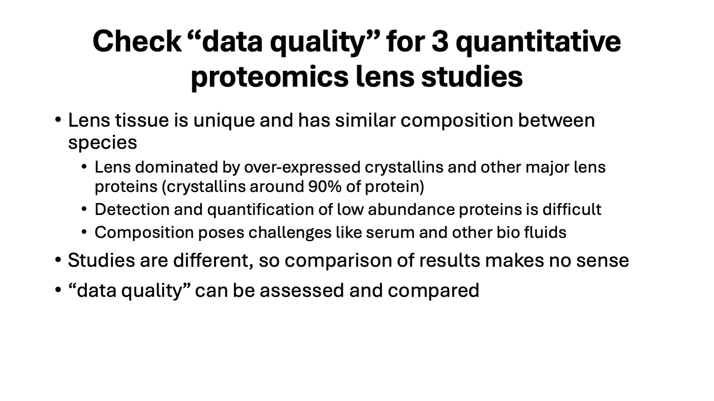

# quantitative_proteomics_comparison

Comparison of DIA to spectral counting to TMT quantitative techniques using animal lens studies.

### June 20, 2025

---

quant_technique_comparison.ppt - Powerpoint with notes

---

A zebrafish lens study using DIA was recently published in JASMS and I was curious what the data was like (I have not generated any DIA data personally).

---

What quantitative proteomics method to use is an evergreen question. Many techniques have come and gone over the years. Spectral counting has been around since 2004 [1] and is the Rodney Dangerfield of quantitative techniques (it doesn’t get any respect). Tandem mass tag (TMT) isobaric labeling [2] needed the synchronous precursor selection (SPS) MS3 method [3] to actually work and the Tribrid Orbitraps from Thermo have been around since 2014 [4]. DIA has been bouncing around since 2006 [5] and has needed a lot of instrument and software improvements to become more usable (in the past 5-7 years?).

> [1] Liu, H., Sadygov, R.G. and Yates, J.R., 2004. A model for random sampling and estimation of relative protein abundance in shotgun proteomics. Analytical chemistry, 76(14), pp.4193-4201.

> [2] Thompson, A., Schäfer, J., Kuhn, K., Kienle, S., Schwarz, J., Schmidt, G., Neumann, T. and Hamon, C., 2003. Tandem mass tags: a novel quantification strategy for comparative analysis of complex protein mixtures by MS/MS. Analytical chemistry, 75(8), pp.1895-1904.

> [3] McAlister, G.C., Nusinow, D.P., Jedrychowski, M.P., Wühr, M., Huttlin, E.L., Erickson, B.K., Rad, R., Haas, W. and Gygi, S.P., 2014. MultiNotch MS3 enables accurate, sensitive, and multiplexed detection of differential expression across cancer cell line proteomes. Analytical chemistry, 86(14), pp.7150-7158.

> [4] Senko, M.W., Remes, P.M., Canterbury, J.D., Mathur, R., Song, Q., Eliuk, S.M., Mullen, C., Earley, L., Hardman, M., Blethrow, J.D. and Bui, H., 2013. Novel parallelized quadrupole/linear ion trap/Orbitrap tribrid mass spectrometer improving proteome coverage and peptide identification rates. Analytical chemistry, 85(24), pp.11710-11714.

> [5] Silva, J.C., Gorenstein, M.V., Li, G.Z., Vissers, J.P. and Geromanos, S.J., 2006. Absolute quantification of proteins by LCMSE: A virtue of parallel MS acquisition* S. Molecular & cellular proteomics, 5(1), pp.144-156.

---

Comparing anything in proteomics is more challenging than most folks think. The many options for every single step in a proteomics experiment affect the results (sometimes a little, sometimes a lot). No two proteomics experiments are ever the same. Comparing things at too fine a level will fail. Higher level, more qualitative metrics need to be considered, and any comparisons will need subjective interpretation. Experience and expertise are important in drawing any meaningful conclusions. Standard mixes and two proteome spike-in mixtures are of limited utility. Those samples are not completely useless to analyze, but they don’t stress test instrumentation and analysis software in the same way that real-world samples will. It is better to find a class of real-world samples that challenge the quantitative techniques, that have been studied with different methods and in different labs, have some de facto standardized sample processing protocols, and have well-understood proteome characteristics (prior knowledge). The lens tissue in eyes meets these requirements. Human and many animal species lenses have been studied for decades using traditional biochemistry methods and using mass spectrometry and proteomics methods.

There was a recent JASMS article using DIA to characterize zebrafish lenses [1] that caught my eye. I worked on some other lens projects that our core did recently that used spectral counting (rhesus money lens) and deep proteome profiling with TMT (mouse lens) for comparison to the DIA data.

> [1] Zelle, S.R., McDonald, W.H., Rose, K.L., Mchaourab, H.S. and Schey, K.L., 2025. Data-Independent Acquisition Parallel Accumulation–Serial Fragmentation (diaPASEF) Analysis of the Separated Zebrafish Lens Improves Identifications. Journal of the American Society for Mass Spectrometry.

---

Whole zebrafish lenses were separated into cortex (the outer part of the lens containing more recent protein synthesis) and the nucleus (the central part of the lens containing the oldest protein). Proteins digested with S-trap columns and trypsin. Two different DIA platforms were evaluated: a Themo Exploris 480 instrument and a Bruker timsTOF HT PASEF instrument. Sample loads (150 ng) were the same, the LC and gradient were different. Three 10-month-old zebrafish lens were separated into cortex and nucleus regions (6 samples in total). The sample were run in a single shot experimental design. A library-free data analysis was performed with DIA-NN (v1.9) with MaxLFQ protein data exported for quantitative analysis. The MaxLFQ data for both platforms was available in long table format in Supplemental File 2.

---

An aging change in rhesus monkey lens study was done in our core recently where two ages were compared using spectral counting. Proteins from the lenses of younger or older monkeys were separated by water solubility before S-trap digestion and processing with a Thermo Q-Exactive HF instrument. The solubility separation was done because lens proteins become less water-soluble with increasing age. Proteins and protein PTMs enriched in the water insoluble fractions could offer insight into aging changes in lens that lead to cataract. The data was processed using the OHSU PSR Core’s in-house Comet/PAW pipeline (https://github.com/pwilmart/PAW_pipeline). You may either lover or hate spectral counting, but it is reliable for detecting larger relative proteins abundance differences between samples and for ranking relative protein abundance within proteomes.

---

Another recent project was comparing the 22-day old mice lenses between wild type, and several knock out mice (knock out of specific lens proteins). The comparison was done using TMTpro labeling and deep fractionation. Proteins were digested using S-trap columns, labeled with 18-plex TMTpro reagents, and a large sample load (46 micrograms) was separated into 20 fractions with each fraction analyzed using a 140-min gradient. The same Comet/PAW pipeline used in the spectral counting experiment also does TMT experiments.

---

All the samples are of extremely specialized animal lens tissue where small number of crystallins (and other major lens proteins) are highly over-expressed. There are other, lower abundance proteins in lens samples that come from epithelial cells and differentiating lens fiber cells in the outer cortex. The presence of the over-expressed major lens proteins makes detection and quantification of these lower abundance proteins very difficult. This is similar to many biofluids such as serum, tear, saliva, etc. Biofluids have many sample collection issues that complicate comparisons. Lens is a better-defined starting source of proteins with a composition more similar to biofluids than to other tissue lysates. These studies are addressing completely different lens biology questions. There is no point in comparing results (or even looking at the results). “data quality” is a more subjective concept but it can be assessed and compared with the right tools and expertise.

---

I have quality control Jupyter notebooks, developed over several years, that I have used on hundreds of core projects that can accommodate most quantitative proteomics results data after some data cleaning. For example, contaminants and non-quantifiable low abundance proteins (with excessive missing values) need to be identified and excluded. The typical cleaning steps and descriptions of the QC metrics are in the Github link. The QC notebooks are a bit like a template, but they do require some editing/customization for each analysis. A standard data table layout is what the notebooks read with each row being a different protein and the columns being different biological replicates. The cell are the quantitative values. The first column is typically some unique identifier like a protein accession string. I always use the Bioconductor package edgeR [1] for statistical testing. It includes the trimmed mean of M-values normalization function [2], a median matching method.

> [1] Robinson, M.D., McCarthy, D.J. and Smyth, G.K., 2010. edgeR: a Bioconductor package for differential expression analysis of digital gene expression data. bioinformatics, 26(1), pp.139-140.

> [2] Robinson, M.D. and Oshlack, A., 2010. A scaling normalization method for differential expression analysis of RNA-seq data. Genome biology, 11, pp.1-9.

---

Boxplots are commonly used to check data normalizations. They show the distributions of quantitative values in each sample (the log10 of the intensities). The colored boxes are the interquartile range (from the 25th percentile to the 75th percentile, i.e., half of the values). The notches in the centers of the boxes are the median values. The top and bottom whiskers have different definitions depending on who you ask; they are designed to encompass the majority of the data values. Points above or below the ends of the whiskers are distribution “outliers” (not to be confused with the concept of an outlier sample that might be excluded). The Exploris 480 DIA data is on the left and the Bruker PASEF DIA data is on the right. These boxplots look okay (the ones on the right are a little better). The nuclear region of replicate 3 appears to have higher levels of highly abundant lens proteins (like crystallins).

---

These are the boxplots for the monkey lenses on the left and the mouse lenses on the right. Spectral count data is more discrete and does not result in as nice-looking boxplots. The water soluble and water insoluble samples have some clear differences in terms of spectral count distributions. The deep proteome profiling with the fractionated TMT experiment has very consistent the reporter ion intensity distributions per sample. The number of lens proteins detected and quantified is also impressive.

---

Clustering (either PCA or MDS, used here) uses some subset of the date to define a distance measure so that sample points near each other are similar and points farther away are more different. Ideally (if looking for differences), the samples in biological groups would cluster together and the biological group clusters would have separation between them. The MDS function in edgeR/limma uses the 500 proteins with the highest variance (across all samples). These are dimension reduction methods, and each reduced dimension has different weights (the x-axis first dimension explains about 70% of the variance here, the y-axis second dimension explains about 15% of the variance). Samples are color coded by biological group. With either DIA platform, cortex samples (blue) are separate from nucleus samples (red). The third replicate does not cluster as tightly as the other two replicates. Since the nucleus and cortex separated regions are coupled (proteins are either in the nucleus or not in the nucleus (cortex is really what is not in the leftover nucleus; i.e., outer nucleus, inner cortex, outer cortex, and epithelial cells), ”Nucleus3” and “Cortex3” are both farther from the other respective replicates.

---

There are 4 groups for the rhesus lens study (left) and 5 groups for the mouse lens study (right). The groups all form separate clusters independent of the quantitative technique. For the monkey lenses, solubility differences are larger than age differences. Each of the 4 mouse genotypes (WT, M1, M2, and M3) with 4 replicates each form nice, well-separated clusters. The M4 group with two replicates is less distinct. There should be statistically significant differentially abundant proteins in any of these group comparisons in any of the 3 studies.

---

The distributions of protein coefficients of variance (CVs) is another informative metric. The median CV and the broadness of the CV distribution are relevant QC metrics. The Thermo Exploris 480 DIA data has large median CVs and broad CV distributions. The Bruker PASEF DIA data on the right looks better, with lower median CVs and narrower distributions. Given that the samples are from laboratory animals (controlled conditions) and that DIA supposedly removes the excessive random variability that so severely(!) limits DDA data acquisition methods, these median CV values and distributions are not impressive to me.

---

The spectral counting data for rhesus has large median CVs and wide distributions. That is partly due to the nature of spectral counting and single shot experimental designs (small counts are rather discrete), and part is due to the higher biological variability of wild monkeys raised in a nature preserve (a non-laboratory setting). The mouse TMT data is very good. The median CVs are what one expects for easier-to-process samples from laboratory mice. The SPS–MS3 TMT data can have median CVs of around 3% for technical replicates, median CVs in the teens for more difficult samples from laboratory animal models, median CVs in the low 20% range for “better” human samples up to 50% median CVs for “harder” human samples. MS2-based reporter ion readout data is much more artificially compressed compared to SPS-MS3 TMT data and low median CVs and narrower CV distributions for MS2-based TMT do not really mean that the data quality is good (quite the contrary).

---

Sample-to-sample scatter plots within biological groups show how consistent the measurements are for samples that should be similar. The cortex samples from the DIA experiments are shown above. Cortex replicates 1 and 2 are a little more similar than the third replicate. The diagonals in the grids have the intensity distributions for each sample, a histogram of the intensities, and a Gaussian kernel smoothed fit. The samples have bimodal intensity distributions. That might be a reflection of the lens proteome where a small number of major lens proteins are very abundant and other proteins are much less abundant (from the small number of epithelial cells or early-stage differentiating fiber cells). The low abundance distribution could also be from false positive low abundance protein identifications combined with a lot of integrated noise masquerading as signal. Error control for peptide identification in DIA seems to be problematic and far from a solved problem. Random noise matching may not be modeled correctly, or the major source of error are not random matches. m/z space is extremely discrete and cannot be modeled with uniform distributions. I suspect that DIA data is a combination of okay identifications and quant estimates with a large mixture of false positive IDs and mass spec noise added. Distinguishing the okay data from the bad data would seem to be a big issue.

---

For the spectral counting monkey lenses study, the young water-soluble group is shown (left). The discrete nature of count data form small values is a characteristic of spectral counting and why designing spectral count experiments to increase count values is important (higher sample loads, longer LC gradients, faster scanning instruments). The mouse lens TMT data is shown on the right for the wild-type group. The benefits of the fractionated deep proteome profiling can be clearly seen in the 8 decades of relative abundance measurements. The consistency of intensities for the highest to medium abundance proteins is exceptional. There is an increase in dispersion at the lowest intensities that can be modeled in the statistical testing. The intensity distributions on the diagonal are much more symmetrical indicating few of the measurements are near the noise thresholds. Proteome depth and data quality are dramatically better for the TMT data. This experiment used 20 LC runs for 18 samples and that is essentially the same LC time as 18 single shot runs (assuming sensible LC gradient times).

---

Another QC check is to take the average measurements per biological group and do scatter plot grids of the biological group averages. In most experiments, there is an expectation that there will be some differences between the biological groups. This contrasts with the assumption that samples within groups should not have differences. There are additional assumptions in the statistical testing that should be verified. The rule of thumb in these comparative experiments is that the majority of the proteins do not have any differential abundance differences. This is usually a key assumption for normalization algorithms; however, statistical testing depends critically on proper normalization. The question is always what fraction of the proteins need to be unchanged for the comparison to be valid? That is hard to answer, but more than 50% seems like a good ballpark number. In these plots, there is no determination of how many proteins are unchanged per se. It is more of a sanity check situation. Do most of the proteins fall along a diagonal trend line? Are there modest numbers of proteins that seem to be off the diagonal and outside of some imagined unchanged protein distribution.

How do the highly abundant proteins behave? These can often be house keeping proteins that would be expected to be at similar relative abundances between groups. These experiments are also frequently designed to work with equal total amounts of protein per sample. That effectively constrains abundance differences for the most abundance proteins, and they should be closer to the diagonal trend line than lower abundance proteins with the freedom for larger relative abundance differences. These scatter plots suggest differences between cortex and nucleus (as expected). However, the wide scatter in the high abundance proteins is not what I would expect. Things are complicated in lens with the high abundance of crystallins. Zebrafish has additional gene duplication issues and has many more crystallin proteins than other higher eukaryotic species. Collections of homologous proteins pose challenges to quantitative algorithms. There will be many shared peptides with limited quantitative information content. How protein are grouped affects definitions of what peptides are shared (between proteins, between indistinguishable protein groups, or between extended protein groups. I think DIA-NN uses the razor peptide concept, which is a terrible choice for quantitative studies (maybe okay for reporting identifications). The razor protein concept creates erratic “all or nothing” treatment of shared peptides and that can really invalidate quantitative measurements. This bad situation is magnified when protein families have large fractions of shared peptides (house keeping genes or specific protein families like zebrafish crystallins).

---

The rhesus study group average scatter plots are on the left above. The comparison between younger and older water-soluble proteins is highlighted. In some sense, solubility selects for proteins that have not suffered aging damage (i.e., appear younger), so it is not surprising to see a tight scatter plot that is very similar to the sample-to-sample within group scatter plots. There should be significant differences between the water-soluble and water-insoluble proteomes, and those scatter plots are very broad. The TMT mouse lens data on the right indicates that the genotypes are not causing big changes to the lens proteomes. Given the small CVs, though, many modest fold changes might be statistically significant. The 2-fold change lines in these log scatter plots are not very far from the diagonal.

---

There is much known about lens development and lens tissue. There are expected proteome differences when doing a cortex versus nucleus lens region analysis. The center of the lens contains the oldest proteins, and the outer edges of the lens are more recently synthesized proteins. The major lens proteins will be the most enriched in the lens center in the mature fiber cells. The anterior face of the lens has a monolayer of epithelial cells that are more typical in composition to other cell types. Those cells differentiate into mature fiber cells in the outer cortex (i.e. go from a more normal proteome to the highly over-expressed lens proteome of mature fiber cells). Thus, we expect more crystallins and other major lens proteins in the nucleus, which push low abundance proteins below the detection limits. It is also not known to what extent “non-lens” proteins are degraded during fiber cell maturation and may no longer be present in mature fiber cells. Cortex cells with relatively less major lens protein abundance should have increased relative abundance of non-major lens proteins making them easier to detect. Normalization in proteomes with changes in highly abundant proteins is tricky. Some normalization methods tend to equalize the most abundant proteins. Then you see no changes in major lens proteins and significant changes in all the low abundance proteins. If proteomes have some similarity, then matching the levels of the median abundance proteins can be done. That removes constraints on the highly abundant proteins so that they can have abundance differences and tends to remove biases for lower abundance proteins so that more balanced Up and Down abundance differences can be detected and that more or the lower abundance proteins are not at different abundance levels. Both ways to normalize the data are valid and depend on the questions being asked. However, they can produce very different statistical testing results.

The testing done in the publication was rather simple with arbitrary p-value and fold change cutoffs. This resulted in few DE candidates with either DIA platform, and no crystallins reported as having statistically significant abundance differences. I have been using the Bioconductor package edgeR for spectral counting and TMT data for years, and the results seem appropriate for the data and make sense biologically. A basic two sample comparison was done with the two DIA datasets using the exact test in edgeR after TMM normalization. edgeR does Benjamini-Hochberg multiple testing corrects by default. DE candidate criteria in discovery experiments are often relaxed and Benjanini-Hochberg adjusted p-values (an FDR) of less than 0.10 are what I use.

---

The results of the testing used in the publication are in the first two data columns of the above table. One column is DIA done on the Thermo Exploris 480 (DIA) and the other column is the data from the Bruker PASED DIA data (PASEF). The edgeR testing results are in the last tow data columns. There are dramatically more DE candidates with the edgeR testing that is consistent with the MDS clustering where the two lens regions were in well-separated clusters. There are also many crystallins that are significantly enriched in the nucleus compared to the cortex (as expected). There are many choices in designing quantitative proteomic experiments from samples to bench steps to analytic platforms. There are also many choices for the data analysis steps and those need to be explored to make sure that sufficient information is extracted from the data and that the results make sense give prior knowledge and the data characteristics gleaned from the QC checks.

---

The data, unlike marketing departments and sales reps, does not lie. Fractionated TMT experiments provide the best data with respect to profiling depth and data quality. You need to use as many fractions as channels and appropriate sample loads to get the most “bang for the buck”. Reagent costs are not that high and LC/mass-spec time will be similar compared to a single shot experiments (each sample processed with one LC run) with similar LC gradient lengths (assuming 16-18 samples in the study). The proteomics road is littered with abandoned quantitative methods: 2D-PAGE, DIGE, iCAT, SILAC, spectral counting, iTRAQ, and label-free MS1 integrated features). I am afraid isobaric labeling will be the next to go. The hype and over-selling of DIA seems to know no bounds and the bandwagon had better be large enough to accommodate everyone for the length of time before the next quantitative method promises to solve all the past quantitative sins. DIGE fixes the gel alignment problem. iCAT gets rid of the gels. SILAC removes all variability. Spectral counting is like free quantitation (you are already doing it!). iTRAQ has 4 channels so you can do real (sketchy) statistics. Label-free MS1 features is like combining spectral counting with extracted ion chromatograms and is so much simpler and cheaper than labeling samples…

Single shot experimental designs sound simple but do not work as well as they sound in practice. LC and mass spec systems are finicky, and label free methods do not like finicky. The set of identified proteins in an experiment is (always) confused with the much smaller number of quantifiable proteins in the experiment. The quantitation depth is much less than the identification depth. Failure to see the difference leads to analyses with excessive missing data, not very smart attempts to impute missing values, and becomes an exercise in hypothesis testing of noise. LC systems have finite dynamic ranges (you can only load so much digest), mass spectrometers of all types have limited linear dynamic range (this is why limits of quantitation are always higher than limits of detection), the whole analytical platform needs time to separate peptides and sequence peptides. Faster scanning (maybe in DDA but not really DIA) does nothing to address the dynamic range issues. There is no free lunch (not even at that marketing seminar). If you want good quantitative data, you must spend the time and effort.

I have never bought into the DIA world (as you have already guessed), but everyone else seems to have drunk the Kool Aid. From top labs to instrument vendors, completely absurd claims have been lapped up and amplified. DIA is yet another quantitative proteomics method over-hyped so that mature methods get abandoned instead of refined for wider use. Instead of amplifying good scientific studies, we amplify marketing department brochures. Instead of publishing exemplary science papers, we publish an endless sea of proof-of-principle methods papers. Jumping to the next “big thing” before mastering the old thing is a poor investment of time and resources.

The data here is compelling and hard to argue with. Feel free to have issues with my interpretation of the data, although I have 22+ years experience doing proteomics data analysis and have looked at many hundreds of quantitative studies with a consistent set of software tools. Spectral counting works, although no one seems willing to say that in public. It has known and understandable limitations but does the job in the right context. I have played with MS1 feature label free data and it suffers from all the single shot experimental design issues. If you exclude low abundance proteins (and the majority of the missing data that is associated with them), quantitative profiling depth is not great. If you think about it some, it is just an intensity-weighted spectral counting method and proteins with handfuls of mapped features have a discreteness to the data that the intensity weights mask. One wonders if statistical modeling of this type of data has ever been done correctly. The DIA data here looks somewhat better than spectral counting. It is hard to estimate how many false positive peptide identifications and integrated noise values are present in the final results. It is clearly at high enough levels to raise serious questions. Results for these experiments are never known but there is usually some limited prior knowledge (probably of higher abundance proteins), and DIA probably does well enough with those to pass some quick “sniff test”. The data is likely a mix of okay data and data that are either false positive identifications or noisy quantitative measurements. Without any ability to tell those cases apart, it is not clear if scientific conclusions from DIA studies should be trusted. If something sounds too good to be true, it usually isn’t.

---

Phil Wilmarth   June 20, 2025
